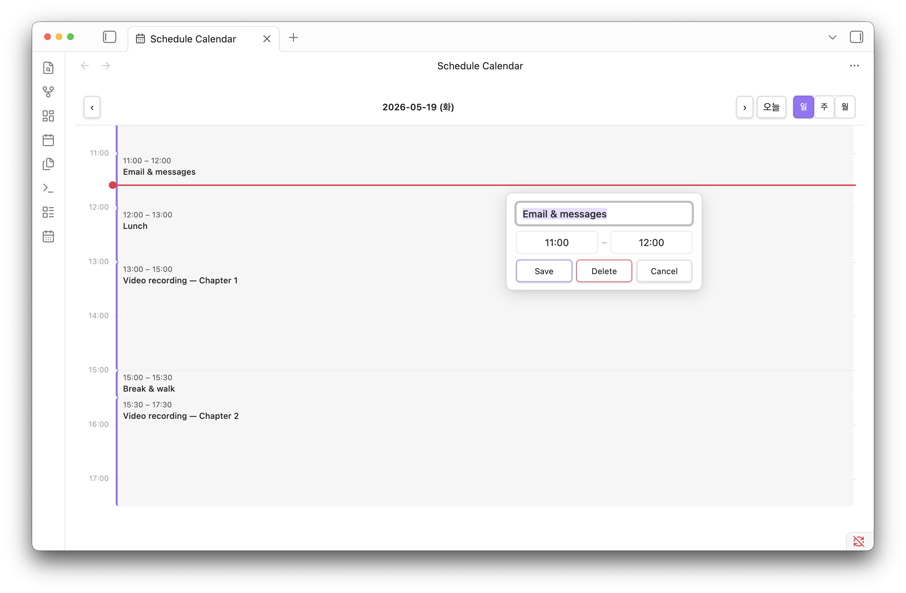
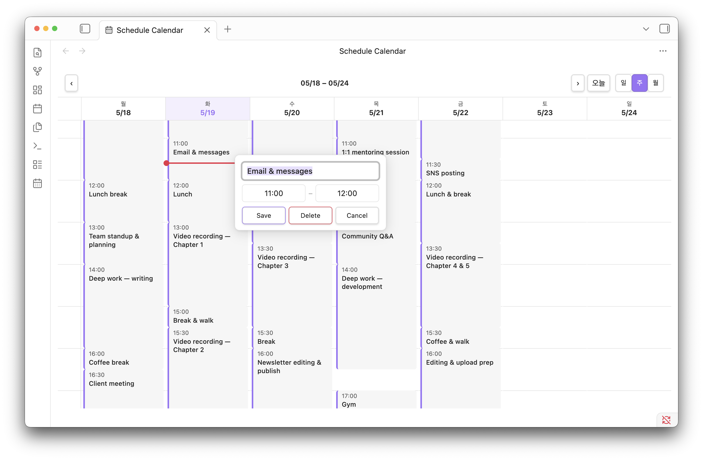
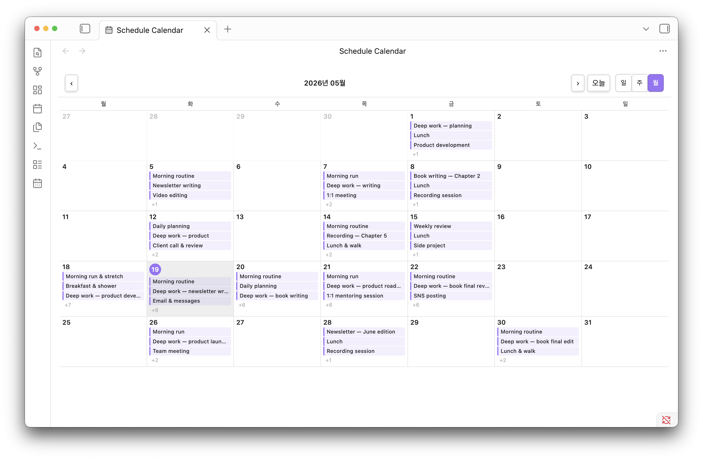

# Schedule Calendar

A visual interactive calendar for [Obsidian](https://obsidian.md) — turn your daily note schedules into a drag-and-drop timeline, just like Notion Calendar.

## Features

### Views
- **Daily view** — 24-hour timeline with full drag, resize, and edit support
- **Weekly view** — side-by-side 7-day overview
- **Monthly view** — grid calendar with event chips per day, click to jump to daily view

### Interactions
- **Drag to move** — drag events up/down to reschedule (snaps to 15-minute intervals)
- **Resize** — drag the bottom edge of an event to change its end time
- **Click to edit** — click any event to open a popup and edit title or time
- **Delete** — remove an event directly from the edit popup
- **Double-click to add** — double-click any empty time slot to create a new event; a ghost preview shows the time range before you confirm
- **Auto-sync** — all changes are instantly written back to your note file

### Other
- **Now line** — red indicator showing the current time
- **Configurable** — section name, note folder, and default event duration are all customizable

## Screenshots

| Daily | Weekly | Monthly |
|-------|--------|---------|
|  |  |  |

## How It Works

Schedule Calendar reads schedule entries from your daily notes and renders them as interactive blocks on a timeline. Any changes made in the calendar are written back to the note file automatically — no separate database.

### Schedule Format

Your daily note must contain a `### Schedule` section with entries in this format:

```markdown
### Schedule
- 09:00 - 10:00 Morning routine
- 10:00 - 13:00 Deep work
- 13:00 - 14:00 Lunch
- 14:00 - 18:00 Meetings
```

The section name (`Schedule`) is configurable in settings.

## Installation

### From Community Plugins (recommended)

1. Open **Settings → Community plugins**
2. Disable **Restricted mode** if enabled
3. Click **Browse** and search for `Schedule Calendar`
4. Click **Install**, then **Enable**

### Manual Installation

1. Download `main.js`, `manifest.json`, `styles.css` from the [latest release](https://github.com/seonggoos/obsidian-schedule-calendar/releases/latest)
2. Create a folder: `<vault>/.obsidian/plugins/schedule-calendar/`
3. Copy the three files into that folder
4. Open Obsidian → **Settings → Community plugins** → enable **Schedule Calendar**

### BRAT (Beta)

1. Install the [BRAT plugin](https://github.com/TfTHacker/obsidian42-brat)
2. Add `seonggoos/obsidian-schedule-calendar` as a beta plugin

## Usage

- Click the **📅 calendar icon** in the left ribbon, or
- Open the command palette and run **Open Schedule Calendar**
- Use the **일 / 주 / 월** (Day / Week / Month) toggle in the header to switch views
- Use **‹ ›** arrows to navigate, and **오늘** (Today) to jump back to today
- In weekly/monthly view, click a day to open it in daily view

## Settings

Go to **Settings → Schedule Calendar** to configure:

| Setting | Default | Description |
|---------|---------|-------------|
| Schedule section | `Schedule` | The `###` heading to parse schedules from |
| Daily note folder | `30.Calendar/31.Daily/` | Folder path where daily notes are stored |
| Default event duration | `30 min` | Default event duration when adding via double-click (15 / 30 / 60 / 90 / 120 min) |

## Compatibility

- Obsidian v1.0.0+
- Works with [Daily Notes](https://help.obsidian.md/Plugins/Daily+notes) core plugin
- Works with [Periodic Notes](https://github.com/liamcain/obsidian-periodic-notes) plugin

## License

[MIT](LICENSE)
